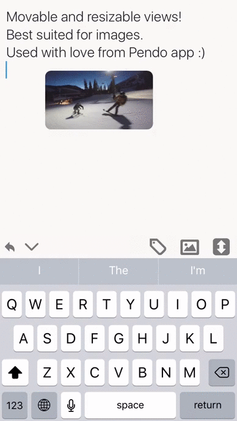

# MoView

MoView by hyouuu, made for Pendo, based on [SPUserResizableView](https://github.com/spoletto/SPUserResizableView).    

It is a movable, resizable view, with special attention to be used with UIImage, thus providing Save, Copy and Delete menu options.

It has been used by Pendo in App Store with lots of users, so is considered production ready. Pull requests welcome to make it better & better! :D

[](http://cocoapods.org/pods/MoView)
[](http://cocoapods.org/pods/MoView)
[](http://cocoapods.org/pods/MoView)



## Usage

In your view controller:

```swift
import MoView

class YourViewController: UIViewController, MoViewDelegate {
  // Get a hold of MoViews
  var mediaViews = [MoView]()
  
  // Example setup
  let imageFrame = CGRectMake(posX, posY, width, height)
  let mediaView = MoView(frame: imageFrame)
  mediaView.copyItemTitle = local("copy")
  mediaView.saveItemTitle = local("save")
  mediaView.deleteItemTitle = local("delete")
  let imageView = UIImageView(image:image)
  imageView.alpha = 0.9
  mediaView.contentView = imageView
  mediaView.delegate = self
  textView.addSubview(mediaView)
  mediaViews.append(mediaView)
 
  // Implement MoViewDelegate - provided some example usages below
  // MARK: MoViewDelegate 
  func moViewTapped(moView: MoView) {
    log("moViewTapped")
  }

  func moViewDidBeginEditing(moView: MoView) {
    log("moViewDidBeginEditing")
    textView.bringSubviewToFront(moView)
  }

  func moViewDidEndEditing(moView: MoView, edited: Bool) {
    log("moViewDidEndEditing")
  }

  func moViewCopyTapped(moView: MoView) {
    if let imageView = moView.contentView as? UIImageView {
      if let image = imageView.image {
        let pasteboard = UIPasteboard.generalPasteboard()
        if let data = UIImagePNGRepresentation(image) {
          pasteboard.setData(data, forPasteboardType: "public.png")
          return
        }
      }
    }
    assertionFailure("copyItem failed")
  }

  func moViewSaveTapped(moView: MoView) {
    if let imageView = moView.contentView as? UIImageView {
      if let image = imageView.image {
        Photor.one.saveImage(image)
      }
    }
  }

  func moViewDeleteTapped(moView: MoView) {
    log("moViewDeleteTapped")
    if let media = moView.media {
      rlmDelete(media as! MediaR, ownerNote: note)
    }
    mediaViews.removeObject(moView)
    moView.removeFromSuperview()
  }
  
```

## Installation

MoView is available through [CocoaPods](http://cocoapods.org). To install
it, simply add the following line to your Podfile:

```ruby
pod "MoView"
```

## Author

hyouuu, hyouuu@gmail.com

## License

MoView is available under the MIT license. See the LICENSE file for more info.
